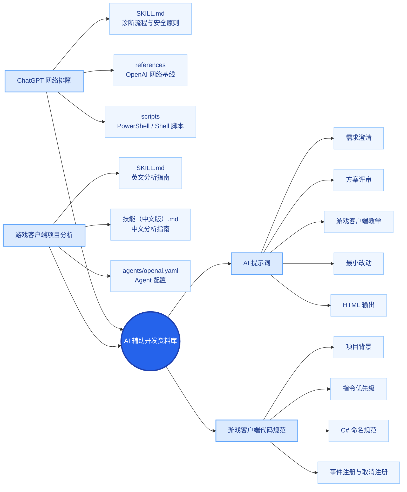

```mermaid
flowchart LR
    %% 左侧分支
    A[ChatGPT 网络排障] --> A1[SKILL.md<br/>诊断流程与安全原则]
    A --> A2[references<br/>OpenAI 网络基线]
    A --> A3[scripts<br/>PowerShell / Shell 脚本]

    B[游戏客户端项目分析] --> B1[SKILL.md<br/>英文分析指南]
    B --> B2[技能（中文版）.md<br/>中文分析指南]
    B --> B3[agents/openai.yaml<br/>Agent 配置]

    A --> R((AI 辅助开发资料库))
    B --> R

    %% 右侧分支
    R --> C[AI 提示词]
    C --> C1[需求澄清]
    C --> C2[方案评审]
    C --> C3[游戏客户端教学]
    C --> C4[最小改动]
    C --> C5[HTML 输出]

    R --> D[游戏客户端代码规范]
    D --> D1[项目背景]
    D --> D2[指令优先级]
    D --> D3[C# 命名规范]
    D --> D4[事件注册与取消注册]

    classDef root fill:#2563eb,color:#fff,stroke:#1e40af,stroke-width:3px;
    classDef branch fill:#dbeafe,color:#1e3a8a,stroke:#60a5fa,stroke-width:2px;
    classDef item fill:#eff6ff,color:#1e3a8a,stroke:#93c5fd;

    class R root;
    class A,B,C,D branch;
    class A1,A2,A3,B1,B2,B3,C1,C2,C3,C4,C5,D1,D2,D3,D4 item;
```
